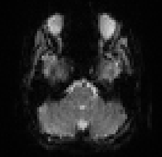
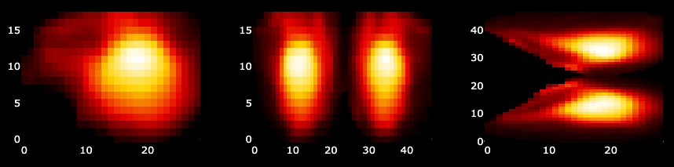

[](https://doi.org/10.1101/2024.10.19.619187)


# HMMeye: eye voxel-based event segmentation using Hidden Markov models

## Welcome!
This repository contains the code for automatic event segmentation using eye voxels as described in [Nau et al. 2024](https://doi.org/10.1101/2024.10.19.619187). Eye voxels are extracted using an automated pipline implemented in [DeepMReye](https://github.com/DeepMReye/DeepMReye). These eye voxels are then cleaned to minimize the influence of head motion. Finally, the cleaned eye voxel time series are then forwarded to a Hidden Markov model (HMM), implemented in the [BrainIAK](https://brainiak.org/) package, which segments the time series into individual events.

## How to use this code?

### Step 1: Make sure the eyes are included in your functional images
Check whether the eyes and optic nerves are included in your functional images. If your images look something like the following, you are good to go! 



Ideally, you scanning sequence uses a P>>A phase encoding direction, leading the eyes to be slightly stretched out to the front (unlike A>>P). However, either might work.

### Step 2: Preprocess your fMRI data
Preprocess your data using [fMRIprep](https://fmriprep.org/en/stable/). Avoid smoothing. At minimum, perform realignment (i.e., head-motion correction) using your favorite preprocessing pipeline.

### Step 3: Install DeepMReye and BrainIAK

Create a conda environment and install [DeepMReye](https://github.com/DeepMReye/DeepMReye) and [BrainIAK](https://brainiak.org/) in it. 

```
conda create --name HMMeye python=3.11
conda activate HMMeye
conda install -c brainiak -c conda-forge brainiak
pip install deepmreye
```

### Step 4: Extract eye voxels
Eye voxels are automatically detected and extracted using [DeepMReye](https://github.com/DeepMReye/DeepMReye). Note that the folder 'functional_data' is assumed to include one subdirectory 'sub*' per participant (e.g., 'sub-01', 'sub-02'...), and that each subdirectory is assumed to contain one 4D-NIFTI file per scanning run.

To run the eye-voxel extraction, clone this repository, then run 'extract_eyevoxels.py' via:
```
cd /your/desired/folder/HMMeye
git clone https://github.com/DeepMReye/HMMeye.git
cd HMMeye
python extract_eyevoxels.py /path/to/functional_data
```

For every NIFTI file, two new files will be created:

- `mask*.p `:  
a Pickle file containing the masked eye voxels. This file is what you need to run the notebook.

- `report*.html`:  
Interactive html file for quality assurance.

Carefully review the 'report*.html" file to confirm that the eye voxel extraction worked. For example, the eye masks should cover the eyes and optic nerves in the top panel. The bottom panel should show the extracted eye voxels (i.e., the content of the 'mask*.p' file) and should look something like the following.



### Step 4: Run the Hidden Markov Model (HMM)

Open "run_HMMeye.ipynb", select your conda environment (here: 'HMMeye'), and follow the steps described in the notebook. An HMM will be trained and tested to segment the eye-voxel time series into events. 
For more details, please see [Nau et al. 2024](https://doi.org/10.1101/2024.10.19.619187). 

To run the notebook, please download the content of the ['eye_voxel_data' folder](https://osf.io/baw39/) on Open Science Framework and place it in the "data" folder of your cloned HMMeye repository.  

## Citations
If you use this codebase, please cite the following article.

> Nau, M., Greene, A., Tarder-Stoll, H., Lossio-Ventura, J.A., Pereira, F., Chen, J., Baldassano, C., & Baker, C.I. (2024).  
> *Neural and behavioral reinstatement jointly reflect retrieval of narrative events*.  
> bioRxiv. [https://doi.org/10.1101/2024.10.19.619187](https://doi.org/10.1101/2024.10.19.619187)

In addition, please cite the articles describing [DeepMReye](https://doi.org/10.1038/s41593-021-00947-w) and [BrainIAK](https://doi.org/10.52294/31bb5b68-2184-411b-8c00-a1dacb61e1da).
## Correspondence
If you have questions, comments, or inquiries, please reach out to Matthias Nau: m.nau@vu.nl